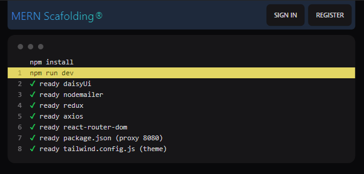

# mern_scafolding

<!---->



## Setup

Edit file `mv /mern_scafolding/api/.env.examples /mern_scafolding/api/.env` , daftar [mongodb](http://mongodb.com) dan isi konfigurasi:

```.env
MONGO = mongodb+srv://<username>:<password>@cluster0.nwouy.mongodb.net/?retryWrites=true&w=majority
```

Generate encryption `openssl rand base64 32` , example :

```.env
JWT=Ol4EZSIhoyijEhj7Nerq33WWDHRWfFJQpIBNZkGwYW0=
```

Email Configuration :

```.env
EMAIL_HOST=smtp.gmail.com
EMAIL_PORT=587
EMAIL_USER=youraccount@gmail.com
EMAIL_PASSWORD=yoursecret
```

<br>

## Postman Testing

Cari file ini : `mern_scafolding.postman_collection.json`

File open `Ctrl-O` [ Upload Files ] , lalu `import`

Contoh format JSON kirim email :<br><br>
endpoint <mark>POST</mark> : `http://localhost:8800/api/mail`

```.json
{
    "to":"destination@email.com",
    "subject":"Judul",
    "text":"Hello World",
    "html":"<b>This is from MERN Scafolding</b>"
}
```

<br>

## `npm install` dan `npm start`

- NodeJS ( express ) directory :
  `/mern_scafolding/api/`
- ReactJS directory :
  `/mern_scafolding/client/`

<br><hr><br>

## Sekarang kamu bisa [sawerin](https://saweria.co/adisakti) 😉

<br>


